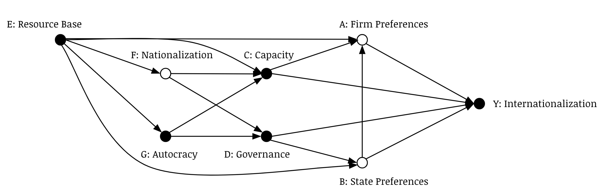

# Why do some NOCs go global? {#paper2}

## Introduction {#intro02}

```{r prelims2, include=F}
library(tidyverse)
library(ggthemes)
library(knitr)
library(nocdata)
```

Nigeria and Angola are the two largest oil producers in Africa, and their NOCs (NNPC and Sonangol, respectively) are two of the most important domestic economic institutions. Both countries have significant levels of international investment into their oil sectors. Both experienced devastating civil conflict until early in the 21st century. Nigeria has a much larger population and economy; Angola performs better, comparatively speaking, on indexes that measure corruption and investment risk.

Despite striking similarities in the area of hydrocarbons in particular, NNPC and Sonangol have strikingly different international footprints (Figure \@ref(fig:sonanNNPC)). Sonangol is one of the most global NOCs in the world: it has substantial ties to Portugal (perhaps unsurprising, given the colonial history the two states share) but it also has subsidiaries across Europe and the Americas. It is invested throughout the African continent. NNPC, despite being one of the largest oil firms in terms of production capacity and resource base, an extremely small international presence: offshore financial subsidiaries in the United Kingdom and Panama, and one liquefied natural gas (LNG) subsidiary in Ghana. This difference is a striking example of variation in NOC internationalization. Like Sonangol,some NOCs have developed an extensive international footprint: they have investments and operating units across a wide range of states, up and down the hydrocarbon value chain. Other NOCs (even large, high-production firms like NNPC) haven't developed that footprint to nearly the same extent, or at all. What explains this variation?^[ Chapter \@ref(#paper1) investigates this variation in detail.] 

```{r sonanNNPC, fig.cap='NOC internationalization: comparing Nigeria and Angola', fig.height = 2, fig.width = 8, fig.align= 'center', dpi=500}
subsidiaries %>%
  filter(Status == "international" & Type == "NOC") %>%
  select(shortname, country, subsidiary_country,
         lat, lon, lat.y, lon.y) %>%
  group_by(shortname, subsidiary_country) %>% 
  summarize(n_subs = n(),
            lat = max(lat),
            lon = max(lon),
            lat.y = max(lat.y),
            lon.y = max(lon.y)) %>% 
  arrange(-n_subs) %>%
  group_by(shortname) %>%
  mutate(tot_n = sum(n_subs)) %>% 
  filter(shortname %in% c("Sonangol", "NNPC")) %>% 
  na.omit() %>% 
  ggplot() +
  borders("world", colour = "white", fill = "seashell2") +
  theme_void() +
  coord_cartesian(ylim = c(-50, 80)) +
  geom_curve(aes(x = lon, y = lat,
                 xend = lon.y, yend = lat.y,
                 color = n_subs),
             curvature = .0) +
  geom_point(aes(lon.y, lat.y, color = n_subs)) +
  geom_point(aes(lon, lat)) +
  facet_wrap(~shortname) +
  scale_color_continuous(low = "grey70", high = "tomato") +
  theme(legend.position="none",
        legend.title = element_blank())
```

The bulk of empirical work addressing NOC internationalization is focused on this question. Political economists and international business scholars have offered several different explanations for why some NOCs go global and others stay at home. This focus is unsurprising. NOC internationalization is one of the most important ways resource-rich states interact with and play an active role in the global economy. The conditions or processes that give rise to this phenomenon are at the heart of what state capitalism is in the context of contemporary political economy, and touch on core concerns as to how social and political influences and institutions play a role in shaping economic outcomes like trade networks and hydrocarbon supply flows. 

Existing explanations for NOC internationalization are, however, constrained in at least two interrelated ways. First, most studies have been developed in a relatively data-sparse environment. Second, many scholars have pursued within-country or small-n case comparative approaches to theory-building and empirical investigation. These choices have likely been influenced by the lack of good cross-national data on NOC internationalization. Approaching the question through a within-country or small-n comparative lens has advantages, but significant limitations as well. Quantitative studies that focus on single countries side-step the problem of poor cross-national data and leverage rich firm-level data in the context of a specific state (many of these focus on China). While grounded in excellent data and rigorous methodologies, however, these studies necessarily struggle to substantiate generalizable claims that explain variation broadly speaking. Qualitative studies encounter the same tradeoff: they are able to apply detailed and insightful information to the task of elucidating the mechanisms that connect political/social influences to outcomes of interest (NOC internationalization chief among them), but we aren't able to draw strong conclusions about how these mechanisms work across the broad range of NOCs in operation globally.

In this chapter we make two moves to improve this situation. First, we take a graph-based approach to causal inference and theory-building [@pearl_causality_2000]. Using directed acyclic graphs (DAG) we formalize a diverse set of expectations about the factors that should influence NOC internationalization into a graphical causal model. This approach has two key benefits: it forces us to explicitly state our theoreical propositions and build them up into a coherent theory, and it allows us to assess whether our model is identified. Second, we evaluate our model's propositions empirically using a novel data source, NOC subsidiary networks (introduced in Chapter 1).

We argue that NOC internationalization is the product of a set of causal processes that range from the immediate, including the decision-time preferences of the stakeholders tasked with deciding on each opportunity for further internationalization, to historical, such as the ways by which authoritarian leadership dynamics are translated into governance structures and tools of institutional oversight. We find that **Insert specific empirical findings here**

The chapter proceeds as follows. In the following section (\@ref(motiv02)) we clearly outline existing explanations for NOC internationalization, focusing on establishing testable hypotheses and a catologue of causal mechanisms proposed across the literature. In section \@ref(approach02) we outline our approach to empirically evaluating these competing claims and mechanisms. We introduce graph-based causal inference, briefly analyze how it has been applied in political economy social science to date, and discuss how it compares to some alternative approaches. Utilizing the methodology introduced in the previous section, we proceed to building a causal graph for NOC internationalization and deriving testable conditions on the basis of the hypothesized structure (Section \@ref(theory02)).

In \@ref(analysis02) we start by using descriptive statistics and visualizations to improve our understanding of the basic correlations at play. We then proceed to statistically evaluating the theory developed in the previous section, and draw conclusions on how these results build on existing scholarship. The final section (\@ref(conclusion02)) concludes by considering some of the key limitations of this approach, and by recommending avenues for further research.

## Motivation: Existing explanations {#motiv02}

Why do some NOCs go global? Scholars have proposed a number of explanations for this variation. The objective of this section is to clearly outline the most significant of these, and identify empirical propositions consistent with the arguments in each. 

### The Commercial Argument

First, the most direct explanation for why NOCs internationalize is because it makes commercial sense for them to do so [@abdelal_profits_2013; @abdelal_multinational_2015]. Going global may involve diversifying operations and capturing value at various parts in the hydrocarbon value chain (eg. refining, distribution, commercial sales), expanding access to new or different resources (or non-hydrocarbon assets/markets altogether), improving access to technology or expertise through new partnerships or different geological conditions, or financial restructuring to take advantage of favourable tax law [@buckley_foreign_1989, @hughes_globalizing_2014, @jaffe_state_2010]. All of these have in them at least the potential of accruing significant commercial benefits to the globalizing firm. These potential benefits are open to all NOCs: the ones that avail of them are the ones with the capacity to. Based on this argument, internationalization makes commercial sense, and more extensive internationalization should be positively correlated with the degree to which a given NOC is a high-functioning commercial entity. From this perspective, internationalization and commercial effectiveness are naturally endogenous: effective/high-functioning firms will be more likely to expand beyond their domestic borders, and when they do they have a good chance of improving their effectiveness.

*Commercial Hypothesis: the more a firm can be identified as high-functioning, the more likely it is to have a high degree of internationalization*

This argument has a substantial degree of prima facie support in the data. The most global NOCs are easily identifiable as strongly market-oriented: most of the top 10 have at least some of their shares floated on public exchanges, even if the state retains a large (or majority) ownership share in the company. 

### The Resource/Market Security Argument

Second, some scholars argue that NOC internationalization is a function of the degree to which the NOC in question needs to secure access to resources or access to markets. Many NOCs were initially established to manage domestic reserves; when these domestic reserves are small to begin with or declining over time, a firm will have strong incentives to improve its medium to long term viability by securing additional resources [@goldstein_new_2009]. The corrolary is that states with large domestic resources relative to their domestic market may be motivated to secure access to export markets. It is important to note that a firm could seek resource and/or market security through international expansion for both commercial and political reasons. There is a strong commercial logic to diversifying and improving a firm's resource base or market access. At the same time, the state owner may have strong political reasons to support or push for diversification and improvement. 

*Resource Security Hypothesis: lower levels and or declining levels of domestic hydrocarbon reserves will correlate with a higher degree of internationalization.*

*Market Security Hypothesis: high levels of domestic hydrocarbon reserves (relative to the domestic market size, or in absolute terms) will correlate with a higher degree of internationalization.*

Despite the clear logic, there seems to be little support to be found for this argument in our international subsidiary network dataset. Higly global NOCs can be found at every level of domestic oil production *except* the lowest, and in fact there is some cursory evidence that substantial domestic production is positively correlated with a large international subsidiary network. Despite this, the historical importance of hydrocarbon wealth cannot be overstated, even if the correlations with outcomes of interest are not immediately revealing.

```{r oil, dpi=200, eval=F, include=F}
subsidiaries %>% 
  filter(Type == "NOC") %>%
  mutate(shortname = case_when(shortname == "QPI" ~ "Qatar Petroleum",
                               shortname == "KPI" ~ "KPC",
                               TRUE ~ shortname)) %>% 
  select(shortname, country, subsidiary_country, Status, ross_oil_prod) %>%
  group_by(shortname, country, Status) %>% 
  summarize(n = n(),
            ross_oil_prod = max(ross_oil_prod)) %>% 
  filter(grepl("domestic|international", Status)) %>% 
  spread(Status, n) %>%
  mutate(international = ifelse(is.na(international), 0, international)) %>% 
  mutate(domestic = ifelse(is.na(domestic), 1, domestic)) %>% 
  mutate(international_scaled = international / domestic) %>% 
  arrange(-international_scaled) %>% 
  mutate(tag = case_when(international > 75 ~ "tag",
                         TRUE ~ "notag")) %>% 
  ggplot(aes(ross_oil_prod, international,
             label = shortname)) +
  geom_point() +
  ggrepel::geom_text_repel(data = . %>%
                    mutate(label = ifelse(tag == "tag",
                                          shortname, "")),
                  aes(label = label),
                  size = 3,
                  box.padding = .5,
                  show.legend = FALSE) +
  labs(x = "Oil Production, metric tons (log transformed)",
       y = "# of International Subsidiaries") +
  scale_x_log10() +
  #scale_y_log10() +
  theme_classic() +
  theme(legend.position="none",
        legend.title = element_blank())
  
```

### The Political Institutions Argument

Third, political economists have argued that political institutions and path dependencies play an important role in determining whether an NOC goes global. @cheon_developing_2019 argues that internationalization depends on the institutional form of the principal-agent relationship (where the principal is the state and the agent is the NOC). A committed executive is a necessary prerequisite to international expansion, as the political, financial, and institutional resources required to enable internationalization are considerable. The stronger the direction from the state, in the form of a motivated executive and a unified bureaucratic/oversight structure, the more likely it is that a NOC will successfully expand beyond its domestic borders. Cheon finds that a strong, singular national principal (eg an autocratic leader) will be better positioned to encourage and sustain internationaliazation, but does not find as strong support for the importance of a unified bureaucracy. 

*Leadership Hypothesis: higher levels of democratic state governance correlate negatively with internationalization*

*Bureaucratic Hypothesis: designated bureaucratic principals (as opposed to oversight by competing bureaucracies) will correlate with increased internationalization.*

@jones_luong_domestic_2015 take a longer term perspective, arguing that political legacies shape internationalization in meaningful ways. In particular, extensive internationalization is only possible when two historical conditions were in place: the NOC emerged through a consentual nationalization process, and the interest of commercial managers and state principals converge on internationalization. 

*Nationalization Legacy Hypothesis: firms with consentual nationalization origins will be more likely to internationalize*

*Nationalization Legacy Hypothesis: firms that benefit from aligned interests on the part of managers and state principals will be more likely to internationalize.*

### The Strategic Argument

Fourth, NOC internationalization may be motivated by a strategic logic: State owners use their firms to project power and influence abroad, or to generate or shore up  strategic relationships [@bremmer_rise_2009; @bremmer_state_2009]. In this view, the NOC is one of the key means by which states are able to interact with other states on the international stage, and state owners utilize this tool to the best of their ability. Because states place value on having an NOC that they can use for political/strategic ends, they will direct the NOC to establish an international presence that makes sense given the strategic interests of the state. As such, this isn't a theory about the degree of internationalization so much as it is about kind. It is also possible that the logic of this theory holds from a commercial perspective as well. A firm may pursue internationalization for its own (commercial) reasons when it knows it has the political support to do so, whether or not that political support is motivated by geostrategic concerns. 

*Strategic Hypothesis: States with a strong interest in projecting power will direct their NOCs to establish an international presence*

**TO DO: Add citations, wrap up, connect to the next section**

Taken together, these arguments present a complex, occasionally contradictory view on the reasons for why NOC internationalization happens the way it does. The objective of the following sections is to construct, and then evaluate, a unified causal model for NOC internationalization, incorporating plausible mechanisms extracted from the literature reviewed to this point. To this end, we use graphical causal modeling, and directed acyclic graphs (DAGs) in particular, to encode our causal theories and allow us to identify opportunities for empirically evaluating our model. Section (\@ref(approach02)) briefly introduces graphical models; we proceed to constructing a causal model of NOC internationalization in Section \@ref(theory02).

## Approach: Graphical Causal Modeling {#approach02}

Causal theories represent our beliefs about how the world works in terms of causes and effects. Graphical causal modelling is an approach that has been developed through work spread across a diverse set of disciplines to visually represent those beliefs. Directed acyclic graphs (DAGs) are the most common of these graphical methods. A DAG is a visual model that encodes specific hypotheses about the causal processess that generate or affect an outcome of interest. Critically, DAGs can be used for both rigorous *identification* (that is, distinguishing causal from non-causal effects) of a theoretical model and *estimation* of the empirical implications of the model. Assuming that a causal model is valid, DAGs allow the researcher to move from identification to estimation by supplying adjustment set, consistent with the model, that allow for estimation of the causal effect of a treatment (or treatments) of interest using parametric or non-parametric statistical techniques. As such, DAGs strictly distinguish between --- but provide a bridge for --- causal models (theory) and statistical models (measurement). 

Visual representations of causal theories have an extensive history in the social and physical sciences, but contemporary DAGs were primarily developed in computer science [@pearl_causal_1995; @pearl_causality_2000]. They have been extended and applied in a broad range of disciplines, but most prominently in sociology [eg. @morgan_counterfactuals_2007; @elwert_endogenous_2014] and epidimiology [eg. @greenland_causal_1999; @cole_fallibility_2002; @hernan_causal_2002]. Application in political science has been limited to date, but see @montgomery_how_2018, @imai_when_2019, @acharya_explaining_2016 and  @blackwell_framework_2012. For a useful introduction to graphical causal modeling and a productive effort to situate it within the methodological landscape of political science in particular, see @keele_causal_2019.

DAGs have two basic component elements: variables encoded in graph nodes, and relationships encoded in the arrows between variables. T $\rightarrow$ Y is a basic DAG, where T represents a treatment variable, Y represents the outcome, and the $\rightarrow$ represents our belief that T may have a causal effect on Y. The "may" is a key part of constructing DAGs: arrows between nodes only represent the possibility of a causal relationship, whereas the absence of an arrow represents the strong belief that there is no possible way one variable has a causal influence on another. A missing arrown is a "definitive claim of knowledge" whereas present arrows "represent the analyst's ignorance" [@elwert_graphical_2013, 248]. Arrows are organized sequentially: DAGs require that causes preceed effects and that there is no simultaneous causation (which is why they are "acyclic" rather than "cyclic"). Within a graphical modelling framework, problems of endogeneity where the value an outcome takes influences the treatment, should be addressed by carefully breaking down the temporal sequence of the causal chain.

DAGs allow a research to determine whether a given model is causally identified by supplying criteria derived from the qualitative causal assumptions the DAG encodes (crucially, these criteria work irrespective of how variables in the model are distributed or what the functional form of the causal effects are). A DAG takes the information about what variables matter to the outcome of interest (that is, the information encoded in the graph) and identifies which variables need to be adjusted for to identify the causal effect of the treatment of interest on the outcome, given the structure of the causal model supplied. This set of variables meets the *adjustment criterion* if it is able to block (control for, condition on, or stratify on) all non-causal/confounding paths in the model, without blocking any noncausal paths between the treatmnt and outcome. The adjustment set a DAG is able to identify enables causal identification. If the adjustment set satisfies the adjustment criterion, the total causal effect of the treatment on the outcome of interest is identified by adjusting for the set. If that set that is not able to meet the adjustment criterion, the model is not causally identified. Contemporary software packages make constructing the DAG trivially easy and automate the process of determining the set of variables that meet the adjustment criterion [@textor_robust_2016]. This results in one of the key benefits of utilizing DAGs, and a graphical approach in general: the straitforward logic of the approach and the easy-to-use tools for implementing it shift the analyst's burden of effort toward coming up with a valid causal model in the first place.^[ This is a necessarily abbreviated discussion of the mechanics of identification within a graphical approach to causal inference. For an excellent introduction, see @elwert_graphical_2013. See also @chen_graphical_2014.]

Building causal inferences through a graphical approach by using a DAG is consistent with the potential outcomes framework for causal inference [@galles_axiomatic_1998; @pearl_causality_2000; @pearl_interpretation_2014; see also the exchange with political methodologists on this point in @imai_comment_2014-1;@pearl_reply_2014]. In particular, the adjustment criterion implies conditional igorability of treatment assigment with respect to the potential outcomes [@rosenbaum_central_1983]. As such, a DAG that identifies an adjustment set which meets the adjustment criteria can also be used to establish that conditional ignorability is satisfied (assuming, within both frameworks for causal inference, that the model is itself valid). This equivalence is crucial, given the foundational importance of the potential outcomes framework to contemporary political science [@rubin_estimating_1974; @holland_statistics_1986].

## Theory: A Causal Model of Internationalization {#theory02}

Armed with an effective graphical tool for causal inference, we can now revisit the disparate theories developed to explain NOC internationalization. Our objective is to build a unified causal model for NOC internationalization, where the outcome of interest (Y) is understood as higher levels of internationalization. In the real world, this is an aggregation of decisions made by stakeholders, generally within the firm but also in the state owner.^[ It also involves a dynamic exchange between the investing firm and the target, and may involve dynamic exchanges between both and regulatory actors. We abstract from these components of the problem to simplify the modeling process.] These decisions are informed by **firm preferences over internationalization (A)**: a firm with a strong interest in acquiring assets abroad will attempt to do so, all else equal. **State preferences over internationalization (B)** may also matter: the state owner may have a perspective on whether internationalization is a worthwhile activity or not. The firm's preferences may be informed by the preferences expressed by the state (let's simplify and assume that the ultimate decision to internationalize is the firm's and the firm will consider the preferences expressed by the state). Together, these elements can be expressed in a basic DAG that encodes our theories for how firm and state preferences are causally related to the outcome of interest, internationalization.

```{r basicmodel, fig.cap='Basic Causal Model of Internationalization', out.width='50%', fig.align='center', echo=FALSE}
knitr::include_graphics("fig/basic_model_2.png")
```

```{r dagitty1, echo=F, eval=F}

library(dagitty)

plot(dagitty('dag {
    A [pos="1,1"]
    B [pos="1,2"]
    Y [pos="2,2"]

    A -> Y
    B -> A
    B -> Y
}'))
```

We can elaborate on the factors that influence the firm's preferences over internationalization (B) by drawing on the arguments and expert knowledge identified earlier. First, the state capacity argument suggests that a firm's perspective on internationalization will be shaped by its capacity, in so far as more capable or commercially-viable firms stand to secure and benefit from the advantages of internationalization (eg. diversification). **Firm Capacity (C)** may influence both firm and state preferences and use those as a path to affecting internationalization (C $\rightarrow$ A | B $\rightarrow$ Y), but it could also affect internationalization directly by changing how other actors view, incentivize, or disincentivize internationalization (C $\rightarrow$ Y). 

State-owned firms also operate in a regulatory and governance environment that may have a significant influence on how that firm goes to market and makes decisions regarding internationalization. **Governance (D)** captures the role that the various formal or institutional organs of state oversight and influence play in the causal process. Governance is at the core of much of the political economy work focused on NOC internationalization. The bureaucratic rules could shape internationalization outcomes directly (D $\rightarrow$ Y) or could operate indirectly by shaping firm Capacity (D $\rightarrow$ C $\rightarrow$ Y), firm preferences (D $\rightarrow$ A $\rightarrow$ Y), or state preferences (D $\rightarrow$ B $\rightarrow$ Y). Together, our updated causal model that incorporates the potential effects of firm capacity and governance is captured in figure \@ref(fig:basicmodel)

```{r dagitty2, echo=F, eval=F}

plot(dagitty('dag {
    A [pos="1,1"]
    B [pos="1,2"]
    Y [pos="2,2"]
    C [pos="0,1.5"]
    D [pos="0,2.5"]

    A -> Y
    B -> A
    B -> Y
    C -> Y
    C -> A
    C -> B
    D -> Y
    D -> A
    D -> B
    D -> C
}'))
```

Firm Capacity and Governance are themselves potentially influenced important variables. **Resource Wealth (E)** has the potential to causally affect firm preferences directly (as a key data input to it's decision-making) or through the firm capacity by influencing how the firm has developed over time to be more or less commercially-oriented (E $\rightarrow$ C). Jones Luong and Sierra (2015) argue that a firm's **nationalization legacy (F)** will impact internationalization by modifying whether the firm has access to key techological resources and expertise (F $\rightarrow$ Y). They also make the case that early firm state preference alignment is important, which in our model has a contemporary effect on the internationalization process by potentially affecting how the governance relationship has been shaped (F $\rightarrow$ D). Cheon (2019) argues that the nature of the political system will also have an impact by shaping the support the state gives the firm: **autocracies (G)** will, all else equal, supply the firm with more direct (and directed) support for internationalization (G $\rightarrow$ B). However, the system of governance is also likely to have shaped the nationalization process (G $\rightarrow$ F) and the governance structure in place (G $\rightarrow$ D). In turn, there is a substantial literature that indicates resource wealth could shape political/institutional outcomes (E $\rightarrow$ G) and the type of nationalization seen (E $\rightarrow$ F). Our full causal model is represented in Figure \@ref(fig:fullmodel). Crucially, the nodes A, B, and F are represented by unfilled points: these are unobserved variables in our model. 

```{r fullmodel, fig.cap='Full Causal Model of Internationalization', out.width='80%', fig.align='center', echo=FALSE, cache=T}

```

Based on the structure of our model given above, we can draw conclusions about identifiability. First, the model is causally identified: the adjustment set sufficient to block all back-door non-causal paths (thereby meeting the adjustment criterion) and identify the total effect on NOC internationalization is [C,D,G,E]. Second, we can potentially use a series of regressions to empirically evaluate the relative importance of each variable. Firm Capacity (C) and Governance (D) are all identified in the model, meaning we can give a causal interpretation to these coefficients. Resources (E) and Autocracy (G) are not identified in this model given that in both cases we condition on their descendants: they function to block back-door paths to the outcome, but are non-causal associations given the structure of the model. However, we are able to estimate the total effect of each of these variables in distinct regressions. The adjustment set sufficient to identify the total effect of Autocracy on NOC Internationalization is [E], and the total effect of Resources on Internationalization can be measured in a simple bivariate regression, no adjustment necessary. The following section explores the measurement necessary to empirically evaluate this model, proceeds to executing and analyzing the regressions identified above.^[ Assessing the causal identification of this model was performed using the `Dagitty` `R` package and online interface [@textor_robust_2016]. The model can be found here: [dagitty.net/mBQp_cy](dagitty.net/mBQp_cy).]

## Analysis:  {#analysis02}

To do for this section:

- Familiarize myself with some applied DAG work, preferably political science
- Subsection: defining variables
- Subsection: model specification 
- Analysis: model development
- Analysis: results table
- Analysis: marginal effects plot
- Subsection: model discussion

### Measurment & Variable Selection

All variables scaled prior to inclusion in regression results.

**Internationalization (Outcome Variable)**: the number of international subsidiaries at the country level. Where a country has more than one NOC, average internaitonal subsidiaries is calculated. 

**Firm Capacity**: proxied by the number of domestic subsidiaries a given firm has, based on the logic that more commercially viable firms will have more domestic subsidiaries, all else equal.

**State Control**: taken from Paasha Mahdavis NOC codebook. Missing data replaced with the middle value (2.5).

**Polity2 Score**: standard measure of democracy

**EIA Proven Oil Reserves**: avg. annual proven oil reserves, 1980-1990. Where there is no data in this time period, we replace null values with the proven oil reserves in 2000. 

### Raw Analysis

```{r, echo=TRUE}
base <- subsidiaries %>% 
  count(shortname, ccode, ccodecow, Status, Type) %>%
  filter(!is.na(Status)) %>% 
  spread(Status, n) %>% 
  mutate(domestic = ifelse(is.na(domestic), 1, domestic)) %>% 
  mutate(international = ifelse(is.na(international), 0, international)) %>% 
  filter(Type == "NOC") %>%
  group_by(ccode, ccodecow) %>%
  summarize(domestic = mean(domestic),
            international = mean(international)) %>%
  left_join(., state_lookup %>% select(-country)) %>%
  distinct() %>%
  rename(country = country_new) %>% 
  select(country, ccode, ccodecow, international, domestic, fh_polity2)
```

```{r, echo=T}
df <- subsidiaries %>% 
  count(shortname, ccode, ccodecow, Status, Type) %>%
  filter(!is.na(Status)) %>% 
  spread(Status, n) %>%
  mutate(domestic = ifelse(is.na(domestic), 1, domestic)) %>% 
  mutate(international = ifelse(is.na(international), 0, international)) %>% 
  filter(Type == "NOC") %>%
  group_by(ccode, ccodecow) %>%
  summarize(domestic = mean(domestic),
            international = mean(international)) %>%
  left_join(., state_lookup %>% select(-country)) %>%
  distinct() %>%
  rename(country = country_new) %>% 
  select(country, ccode, ccodecow, international, domestic,
         dr_eg, bti_ep, bti_gp, bti_gi, icrg_qog, fh_polity2, 
         wdi_oilrent, ross_oil_prod) %>%
  left_join(.,
            read_csv("data/raw/EIA_International_data.csv", na = c(NA, "--")) %>%
              gather(Year, oil, 2:12) %>%
              mutate(reserves = as.numeric(oil)) %>%
              group_by(country) %>% 
              summarize(reserves = mean(reserves, na.rm = T)) %>%
              na.omit() %>%
              mutate(country = case_when(country == "Sudan" ~ "Sudan (2012-)",
                                         country == "Pakistan" ~ "Pakistan (1971-)",
                                         country == "Malaysia" ~ "Malaysia (1966-)",
                                         country == "Cote dIvoire (IvoryCoast)" ~ "Cote d'Ivoire",
                                         country == "Congo (Kinshasa)" ~ "Congo, Democratic Republic",
                                         TRUE ~ country)) %>%
              right_join(., base %>% select(country, ccode)) %>%
              left_join(., read_csv("data/raw/International_data_2000.csv", na = c(NA, "--")) %>%
                          mutate(reserves_2000 = as.numeric(reserves_2000))) %>%
              mutate(reserves = ifelse(is.na(reserves), reserves_2000, reserves))) %>% 
  left_join(., readxl::read_excel("data/raw/noc_var.xlsx") %>% 
              select(ccode, control) %>% 
              na.omit() %>%
              rename(ccodecow = ccode)) %>%
  distinct() %>%
  mutate(control = ifelse(is.na(control), 2.5, control))

df$i_scaled <- scale(df$international)
df$d_scaled <- scale(df$domestic)
df$c_scaled <- scale(df$control)
df$p_scaled <- scale(df$fh_polity2)
df$r_scaled <- scale(df$reserves)

```

```{r basemodels, echo=T}
broom::tidy(summary(lm(i_scaled ~ 
             d_scaled + 
             c_scaled + 
             p_scaled + 
             r_scaled, 
           data = df)))

sd(df$international)
sd(df$domestic)

summary(lm(i_scaled ~ r_scaled, data = df))
summary(lm(i_scaled ~ p_scaled + r_scaled, data = df))
```

```{r basemodelsstorage, echo=T}
m1 <- lm(i_scaled ~ d_scaled + c_scaled + p_scaled + r_scaled, data = df)
m2 <- lm(i_scaled ~ p_scaled + r_scaled, data = df)
m3 <- lm(i_scaled ~ r_scaled, data = df)
```

```{r resultstable, echo=T, results='asis'}
stargazer::stargazer(m1, m2, m3, 
          covariate.labels = c("Firm Capacity", 
                               "State Control", 
                               "Polity2 Score", 
                               "Oil Reserves"),
          dep.var.labels   = "Number of International Subsidiaries",
          type='latex')
```

<br>
Coefficient on scaled "capacity" : 0.46. Coefficient on scaled control : -0.058. Scaling: The result is that the values in the transformed variable have the same relationship to one another as in the untransformed variable, but the transformed variable has mean 0 and standard deviation 1 Interpretation: The effect of scaled capacity (d_scaled) now represents the expected change in standard deviations of internationalization for a 1-standard-deviation increase in capacity; that is, for a 1-SD increase in capacity, we expect a 0.46-SD decrease in internationalization, which we could call an effect of moderate magnitude. Substantive effects: an increase of 70 domestic subsidiaries should lead to an increase of 54 international subsidiaries, all else equal. 

```{r basemodelplot, echo=T}
broom::tidy(m1) %>%
  dotwhisker::relabel_predictors(c(d_scaled = "Firm Capacity",
                       c_scaled = "State Control",
                       p_scaled = "Polity2 Score",
                       r_scaled = "Oil Reserves")) %>% 
  dotwhisker::dwplot() +
  geom_vline(xintercept = 0, color = "grey30", linetype = 3) +
  xlim(-1,1) +
  labs(x = "Coefficient Estimate, Scaled") +
  scale_color_grey() +
  theme_bw() +
  theme(legend.position = "none")
```
